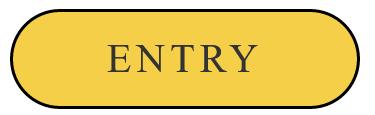
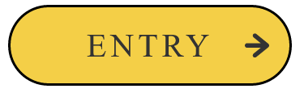
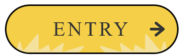
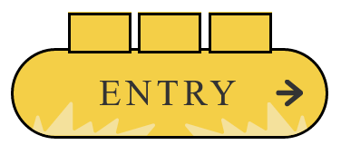
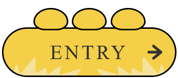
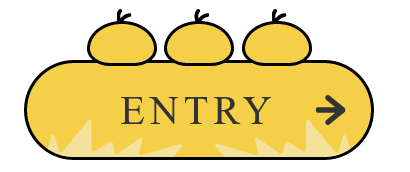
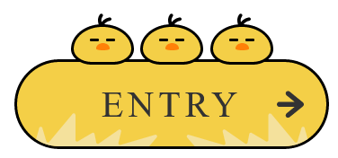

小鸟形状、嘴主要用到了`border-radius`可以四个角分别设置长轴、短轴的的长度，小鸟头上的羽毛和按钮背景主要是`clip-path`的功劳

# 画 Button

```html
<a href="#" class="button button__birds">
  <div class="button__wrapper">
    <span class="button_text">Entry</span>
  </div>
</a>
```

```css
.button__birds {
  --main_color: #f4cf47;
}
.button {
  display: flex;
  justify-content: center;
  align-items: center;

  box-sizing: border-box;
  width: 280px;
  height: 80px;

  text-decoration: none;
  border: 3px solid #000;
  border-radius: 40px;
  background: var(--main_color);
}
.button__wrapper {
  display: flex;
  justify-content: center;
  align-items: center;

  width: 100%;
  height: 100%;
  border-radius: 40px;
}
.button__text {
  font-size: 32px;
  letter-spacing: 4px;
  color: var(--base_color);
}
```

现在看起来应该是这个样子



然后给按钮加上一些伪元素做装饰，这里需要用到定位

通过`clip-path`先来做一个向右的箭头

```diff
.button__birds {
+  --base_color: #333;
}
.button {
+ position: relative;
}
```

```css
.button::before {
  content: "";

  position: absolute;
  right: 20px;

  width: 24px;
  height: 24px;

  background-color: var(--base_color);
  clip-path: path(
    "M24,12.02c0-1.09-.75-1.71-.81-1.77L11.17,.45c-.91-.74-2.21-.56-2.91,.42-.69,.97-.52,2.37,.39,3.11l7.12,5.81-13.7-.02h0C.93,9.77,0,10.76,0,11.99c0,1.23,.93,2.22,2.07,2.22l13.7,.02-7.13,5.78c-.91,.74-1.09,2.13-.4,3.11,.41,.58,1.03,.88,1.65,.88,.44,0,.88-.15,1.25-.45l12.04-9.76c.07-.06,.82-.67,.82-1.77Z"
  );
}
```

现在是这样



接下来为按钮增加一些“小草”的背景

同样给`.button__wrapper`增加`::before`和`::after`伪元素

```diff
.button__birds {
+ --sub_color1: #f4e19c;
}
.button_wrapper {
+ position: relative;
+ overflow: hidden;
}
```

```css
.button__birds .button__wrapper::before,
.button__birds .button__wrapper::after {
  content: "";

  position: absolute;
  bottom: 0;

  width: 130px;
  height: 30px;

  background-color: var(--sub_color1);

  clip-path: path(
    "M13.77,37.35L.25,16.6c-.87-1.33,.69-2.91,2-2.02l12.67,8.59c.81,.55,1.91,.14,2.18-.81l2.62-9.33c.39-1.4,2.34-1.42,2.76-.02l3.6,11.99c.33,1.11,1.74,1.4,2.47,.52L49.38,.52c.87-1.04,2.53-.42,2.53,.95V23.7c0,1.13,1.2,1.83,2.16,1.26l12.75-7.51c.85-.5,1.94,0,2.13,.98l1.5,7.6c.2,1.03,1.37,1.51,2.22,.92l17.74-12.3c1.09-.75,2.52,.25,2.21,1.55l-2.44,10.2c-.26,1.09,.74,2.06,1.8,1.75l30.8-9.04c1.37-.4,2.42,1.26,1.49,2.36l-9.07,10.66c-.83,.98-.1,2.49,1.17,2.42l12.12-.68c1.6-.09,2.12,2.15,.65,2.8l-2.73,1.21c-.18,.08-.38,.12-.58,.12H14.97c-.48,0-.93-.25-1.2-.65Z"
  );
}
.button__birds .button__wrapper::before {
  left: 0;
}
.button__birds .button__wrapper::after {
  right: 0;
  transform: rotateY(180deg);
}
```



加一些 hover 效果动画，文字间距变大，草丛向两侧移动，箭头向右移动

```diff
.button__text {
+ transition: all .3s ease;
}
.button::before {
+ transition: all .2s ease;
}
.button__birds .button__wrapper::before,
.button__birds .button__wrapper::after {
+ transition: all .5s ease;
}
```

```css
.button:hover .button__text {
  letter-spacing: 6px;
}
.button:hover .button__wrapper::before {
  transform: translateX(-12px);
}
.button:hover .button__wrapper::after {
  transform: rotateY(180deg) translateX(-12px);
}
.button:hover::before {
  right: 14px;
}
```

# 睡着的三只小鸟

下面就是画三只小鸟了，在`.button__wrapper`同级下增加`.bird__wrapper`，包含三个`.bird`，每只`.bird`都有一个`.bird__face`

```html
<a href="#" class="button button__birds">
  <div class="button__wrapper">
    <span class="button__text">ENTRY</span>
  </div>

  <div class="bird__wrapper">
    <div class="bird">
      <div class="bird__face"></div>
    </div>
    <div class="bird">
      <div class="bird__face"></div>
    </div>
    <div class="bird">
      <div class="bird__face"></div>
    </div>
  </div>
</a>
```

目前的效果是这样



给小鸟设置圆角

```diff
.button__birds {
+ --bird_radius1: 60px 60px 40px 40px / 48px 48px 30px 30px;
}
.bird {
+ border-radius: var(--bird_radius1);
}
```



接下来给小鸟加上羽毛

```diff
.bird {
+ position: relative;
}
```

```css
.bird::before {
  content: "";
  position: absolute;
  top: -12px;
  left: 22px;
  width: 12px;
  height: 12px;
  background-color: #000;
  clip-path: path(
    "M10.23,3.32c-3.54,.63-5.72,2.51-7.02,4.23-.33-1.58-.34-3.54,.93-5.12,.52-.65,.41-1.59-.24-2.11C3.24-.19,2.29-.08,1.77,.57c-3.82,4.77-.31,11.11-.13,11.42,0,0,0,0,0,0,0,0,0,0,0,0,0,0,0,0,0,0-.01-.02,2.49,.04,2.52,0,.1-.14,1.54-4.82,6.59-5.71,.82-.14,1.37-.92,1.22-1.74s-.94-1.36-1.75-1.21Z"
  );
}
```



然后是`.bird__face`嘴和伪元素画眼睛

```diff
.button__birds {
+ --sub_color2: #ff8108;
+ --bird_radius2: 50% 50% 50% 50% / 78% 78% 22% 22%;
}
```

```css
.bird__face {
  position: absolute;
  top: 15px;
  left: 50%;
  transform: translateX(-50%);
  width: 12px;
  height: 6px;
  background-color: var(--sub_color2);
  border-radius: var(--bird_radius2);
}
.bird__face::before,
.bird__face::after {
  content: "";
  position: absolute;
  top: -4px;
  width: 8px;
  height: 2px;
  border-radius: 4px;
  background-color: #000;
}
.bird__face::before {
  left: -5px;
}
.bird__face::after {
  right: -5px;
}
```



到这里，睡着的小鸟就画完了，主要是通过元素和伪元素进行布局，`border-radius`和`clip-path`设置形状。

# 惊醒的小鸟

接下来就是通过 hover 惊醒小鸟，实现动态效果

只有前两只会醒，所以给它俩单据加`wakeup`类

```diff
<a href="#" class="button button__birds">
  <div class="button__wrapper">
    <span class="button__text">ENTRY</span>
  </div>

  <div class="bird__wrapper">
-   <div class="bird">
+   <div class="bird wakeup">
      <div class="bird__face"></div>
    </div>
-   <div class="bird">
+   <div class="bird wakeup">
      <div class="bird__face"></div>
    </div>
    <div class="bird">
      <div class="bird__face"></div>
    </div>
  </div>
</a>
```

添加“惊醒”动画

```diff
.button__birds {
+ --bird_radius3: 40px 40px 40px 40px / 48px 48px 30px 30px;
}
```

```css
.button:hover .wakeup {
  animation: wakeup 0.2s ease;
  animation-fill-mode: forwards;
}
@keyframes wakeup {
  0% {
    height: 32px;
    border-radius: var(--bird_radius1);
  }
  100% {
    height: 56px;
    border-radius: var(--bird_radius3);
  }
}
```

然后是小鸟眨眼睛的动画

小鸟惊醒后，眼睛是圆的，所以要改变宽高

```css
.button:hover .wakeup .bird__face::before,
.button:hover .wakeup .bird__face::after {
  width: 6px;
  height: 6px;
}
```

给眼睛加上动画

```diff
.button:hover .wakeup .bird__face::before,
.button:hover .wakeup .bird__face::after {
+ animation: eye 5s linear infinite;
}
```

```css
@keyframes eye {
  0% {
    top: -6px;
    width: 6px;
    height: 6px;
  }
  30% {
    top: -6px;
    width: 6px;
    height: 6px;
  }
  32% {
    top: -4px;
    width: 8px;
    height: 2px;
  }
  34% {
    top: -6px;
    width: 6px;
    height: 6px;
  }
  70% {
    top: -6px;
    width: 6px;
    height: 6px;
  }
  72% {
    top: -4px;
    width: 8px;
    height: 2px;
  }
  74% {
    top: -6px;
    width: 6px;
    height: 6px;
  }
  76% {
    top: -4px;
    width: 8px;
    height: 2px;
  }
  78% {
    top: -6px;
    width: 6px;
    height: 6px;
  }
  100% {
    top: -6px;
    width: 6px;
    height: 6px;
  }
}
```

都一样的动作有点呆，可以让第二只小鸟向右看一下（第二只：你咋睡得这么死？）

```css
.button:hover .wakeup:nth-child(2) .bird__face::before,
.button:hover .wakeup:nth-child(2) .bird__face::after {
  animation: eye_2 5s linear infinite;
}
@keyframes eye_2 {
  0% {
    top: -6px;
    width: 6px;
    height: 6px;
  }
  10% {
    transform: translateX(0);
  }
  12% {
    transform: translateX(3px);
  }
  20% {
    top: -6px;
    width: 6px;
    height: 6px;
  }
  22% {
    top: -4px;
    width: 8px;
    height: 2px;
  }
  24% {
    top: -6px;
    width: 6px;
    height: 6px;
  }
  25% {
    transform: translateX(3px);
  }
  27% {
    transform: translateX(0);
  }
  74% {
    top: -6px;
    width: 6px;
    height: 6px;
    transform: translateX(0);
  }
  76% {
    top: -4px;
    width: 8px;
    height: 2px;
    transform: translateX(3px);
  }
  78% {
    top: -6px;
    width: 6px;
    height: 6px;
  }
  80% {
    top: -4px;
    width: 8px;
    height: 2px;
  }
  82% {
    top: -6px;
    width: 6px;
    height: 6px;
  }
  85% {
    transform: translateX(3px);
  }
  87% {
    transform: translateX(0);
  }
  100% {
    top: -6px;
    width: 6px;
    height: 6px;
    transform: translateX(0);
  }
}
```

# 呼吸感

最后要给睡着的小鸟加一个呼吸的感觉

```diff
.button__birds {
+ --bird_radius4: 70px 70px 40px 40px / 48px 48px 30px 30px;
}

.bird {
+ animation: sleep 1s ease infinite alternate;
}
```

```css
@keyframes sleep {
  0% {
    height: 36px;
    border-radius: var(--bird_radius1);
  }
  100% {
    height: 32px;
    border-radius: var(--bird_radius4);
  }
}
```

# 全部代码

```html
<!DOCTYPE html>
<html lang="en">
  <head>
    <meta charset="UTF-8" />
    <meta http-equiv="X-UA-Compatible" content="IE=edge" />
    <meta name="viewport" content="width=device-width, initial-scale=1.0" />
    <title>Document</title>
    <style>
      body {
        display: flex;
        justify-content: center;
        padding-top: 100px;
      }

      .button__birds {
        --main_color: #f4cf47;
        --base_color: #333;
        --sub_color1: #f4e19c;
        --sub_color2: #ff8108;
        --bird_radius1: 60px 60px 40px 40px / 48px 48px 30px 30px; /* 小鸟睡着的形状 */
        --bird_radius2: 50% 50% 50% 50% / 78% 78% 22% 22%; /* 小鸟嘴 */
        --bird_radius3: 40px 40px 40px 40px / 48px 48px 30px 30px; /* 小鸟惊醒的形状 */
        --bird_radius4: 70px 70px 40px 40px / 48px 48px 30px 30px; /* 小鸟睡着吸气的形状（变大） */
      }
      .button {
        display: flex;
        justify-content: center;
        align-items: center;

        box-sizing: border-box;
        width: 280px;
        height: 80px;

        text-decoration: none;
        border: 3px solid #000;
        border-radius: 40px;
        background: var(--main_color);

        position: relative;
      }
      .button__wrapper {
        display: flex;
        justify-content: center;
        align-items: center;

        width: 100%;
        height: 100%;
        border-radius: 40px;
        overflow: hidden;

        position: relative;
      }
      .button__text {
        font-size: 32px;
        letter-spacing: 4px;
        color: var(--base_color);
        transition: all 0.3s ease;
      }
      .button::before {
        content: "";

        position: absolute;
        right: 20px;

        width: 24px;
        height: 24px;

        background-color: var(--base_color);
        clip-path: path(
          "M24,12.02c0-1.09-.75-1.71-.81-1.77L11.17,.45c-.91-.74-2.21-.56-2.91,.42-.69,.97-.52,2.37,.39,3.11l7.12,5.81-13.7-.02h0C.93,9.77,0,10.76,0,11.99c0,1.23,.93,2.22,2.07,2.22l13.7,.02-7.13,5.78c-.91,.74-1.09,2.13-.4,3.11,.41,.58,1.03,.88,1.65,.88,.44,0,.88-.15,1.25-.45l12.04-9.76c.07-.06,.82-.67,.82-1.77Z"
        );

        transition: all 0.2s ease;
      }
      .button .button__wrapper::before,
      .button .button__wrapper::after {
        content: "";

        position: absolute;
        bottom: 0;

        width: 130px;
        height: 30px;

        background-color: var(--sub_color1);

        clip-path: path(
          "M13.77,37.35L.25,16.6c-.87-1.33,.69-2.91,2-2.02l12.67,8.59c.81,.55,1.91,.14,2.18-.81l2.62-9.33c.39-1.4,2.34-1.42,2.76-.02l3.6,11.99c.33,1.11,1.74,1.4,2.47,.52L49.38,.52c.87-1.04,2.53-.42,2.53,.95V23.7c0,1.13,1.2,1.83,2.16,1.26l12.75-7.51c.85-.5,1.94,0,2.13,.98l1.5,7.6c.2,1.03,1.37,1.51,2.22,.92l17.74-12.3c1.09-.75,2.52,.25,2.21,1.55l-2.44,10.2c-.26,1.09,.74,2.06,1.8,1.75l30.8-9.04c1.37-.4,2.42,1.26,1.49,2.36l-9.07,10.66c-.83,.98-.1,2.49,1.17,2.42l12.12-.68c1.6-.09,2.12,2.15,.65,2.8l-2.73,1.21c-.18,.08-.38,.12-.58,.12H14.97c-.48,0-.93-.25-1.2-.65Z"
        );

        transition: all 0.5s ease;
      }
      .button .button__wrapper::before {
        left: 0;
      }
      .button .button__wrapper::after {
        right: 0;
        transform: rotateY(180deg);
      }

      .button:hover .button__text {
        letter-spacing: 6px;
      }
      .button:hover .button__wrapper::before {
        transform: translateX(-12px);
      }
      .button:hover .button__wrapper::after {
        transform: rotateY(180deg) translateX(-12px);
      }
      .button:hover::before {
        right: 14px;
      }

      .bird__wrapper {
        position: absolute;
        top: -54px;

        display: flex;
        justify-content: space-between;
        align-items: flex-end;

        width: 180px;
        height: 56px;
      }
      .bird {
        width: 56px;
        height: 36px;
        box-sizing: border-box;
        border: solid 3px #000;
        background-color: var(--main_color);
        border-radius: var(--bird_radius1);

        position: relative;

        animation: sleep 1s ease infinite alternate;
      }
      .bird::before {
        content: "";
        position: absolute;
        top: -12px;
        left: 22px;
        width: 12px;
        height: 12px;
        background-color: #000;
        clip-path: path(
          "M10.23,3.32c-3.54,.63-5.72,2.51-7.02,4.23-.33-1.58-.34-3.54,.93-5.12,.52-.65,.41-1.59-.24-2.11C3.24-.19,2.29-.08,1.77,.57c-3.82,4.77-.31,11.11-.13,11.42,0,0,0,0,0,0,0,0,0,0,0,0,0,0,0,0,0,0-.01-.02,2.49,.04,2.52,0,.1-.14,1.54-4.82,6.59-5.71,.82-.14,1.37-.92,1.22-1.74s-.94-1.36-1.75-1.21Z"
        );
      }

      .bird__face {
        position: absolute;
        top: 15px;
        left: 50%;
        transform: translateX(-50%);
        width: 12px;
        height: 6px;
        background-color: var(--sub_color2);
        border-radius: var(--bird_radius2);
      }
      .bird__face::before,
      .bird__face::after {
        content: "";
        position: absolute;
        top: -4px;
        width: 8px;
        height: 2px;
        border-radius: 4px;
        background-color: #000;
      }
      .bird__face::before {
        left: -5px;
      }
      .bird__face::after {
        right: -5px;
      }

      .button:hover .wakeup {
        animation: wakeup 0.2s ease;
        animation-fill-mode: forwards; /* 停留在最后一帧 */
      }
      @keyframes wakeup {
        0% {
          height: 32px;
          border-radius: var(--bird_radius1);
        }
        100% {
          height: 56px;
          border-radius: var(--bird_radius3);
        }
      }

      .button:hover .wakeup .bird__face::before,
      .button:hover .wakeup .bird__face::after {
        width: 6px;
        height: 6px;
        animation: eye 5s linear infinite;
      }

      @keyframes eye {
        0% {
          top: -6px;
          width: 6px;
          height: 6px;
        }
        30% {
          top: -6px;
          width: 6px;
          height: 6px;
        }
        32% {
          top: -4px;
          width: 8px;
          height: 2px;
        }
        34% {
          top: -6px;
          width: 6px;
          height: 6px;
        }
        70% {
          top: -6px;
          width: 6px;
          height: 6px;
        }
        72% {
          top: -4px;
          width: 8px;
          height: 2px;
        }
        74% {
          top: -6px;
          width: 6px;
          height: 6px;
        }
        76% {
          top: -4px;
          width: 8px;
          height: 2px;
        }
        78% {
          top: -6px;
          width: 6px;
          height: 6px;
        }
        100% {
          top: -6px;
          width: 6px;
          height: 6px;
        }
      }
      .button:hover .wakeup:nth-child(2) .bird__face::before,
      .button:hover .wakeup:nth-child(2) .bird__face::after {
        animation: eye_2 5s linear infinite;
      }
      @keyframes eye_2 {
        0% {
          top: -6px;
          width: 6px;
          height: 6px;
        }
        10% {
          transform: translateX(0);
        }
        12% {
          transform: translateX(3px);
        }
        20% {
          top: -6px;
          width: 6px;
          height: 6px;
        }
        22% {
          top: -4px;
          width: 8px;
          height: 2px;
        }
        24% {
          top: -6px;
          width: 6px;
          height: 6px;
        }
        25% {
          transform: translateX(3px);
        }
        27% {
          transform: translateX(0);
        }
        74% {
          top: -6px;
          width: 6px;
          height: 6px;
          transform: translateX(0);
        }
        76% {
          top: -4px;
          width: 8px;
          height: 2px;
          transform: translateX(3px);
        }
        78% {
          top: -6px;
          width: 6px;
          height: 6px;
        }
        80% {
          top: -4px;
          width: 8px;
          height: 2px;
        }
        82% {
          top: -6px;
          width: 6px;
          height: 6px;
        }
        85% {
          transform: translateX(3px);
        }
        87% {
          transform: translateX(0);
        }
        100% {
          top: -6px;
          width: 6px;
          height: 6px;
          transform: translateX(0);
        }
      }

      @keyframes sleep {
        0% {
          height: 36px;
          border-radius: var(--bird_radius1);
        }
        100% {
          height: 32px;
          border-radius: var(--bird_radius4);
        }
      }
    </style>
  </head>
  <body>
    <a href="#" class="button button__birds">
      <div class="button__wrapper">
        <span class="button__text">ENTRY</span>
      </div>

      <div class="bird__wrapper">
        <div class="bird wakeup">
          <div class="bird__face"></div>
        </div>
        <div class="bird wakeup">
          <div class="bird__face"></div>
        </div>
        <div class="bird">
          <div class="bird__face"></div>
        </div>
      </div>
    </a>
  </body>
</html>
```
