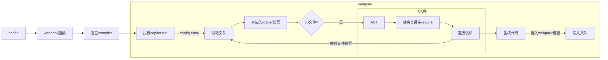

# 从零实现一个迷你 Webpack

Webpack 是当前使用较多的一个打包工具，下面以打包为目的，实现一个简易版的 webpack，支持单入口文件的打包，不涉及插件、分包等。

# 前置知识

以 webpack 5.x 为例，先来简单看个 demo，可以看到 webpac 的输入、输出的代码是什么样的。

源码

```js
// index.js
require("./a.js")
console.log("入口文件")

// a.js
require("./b.js")
console.log("a.js 文件")

// b.js
console.log("b.js 文件")
```

打包后

```js
;(() => {
  var __webpack_modules__ = {
    "./a.js": (
      __unused_webpack_module,
      __unused_webpack_exports,
      __webpack_require__
    ) => {
      __webpack_require__(/*! ./b.js */ "./b.js")

      console.log("a.js 文件")
    },

    "./b.js": () => {
      console.log("b.js 文件")
    },
  }

  // The module cache
  var __webpack_module_cache__ = {}

  // The require function
  function __webpack_require__(moduleId) {
    // Check if module is in cache
    var cachedModule = __webpack_module_cache__[moduleId]
    if (cachedModule !== undefined) {
      return cachedModule.exports
    }
    // Create a new module (and put it into the cache)
    var module = (__webpack_module_cache__[moduleId] = {
      // no module.id needed
      // no module.loaded needed
      exports: {},
    })

    // Execute the module function
    __webpack_modules__[moduleId](module, module.exports, __webpack_require__)

    // Return the exports of the module
    return module.exports
  }
  var __webpack_exports__ = {}

  ;(() => {
    __webpack_require__(/*! ./a.js */ "./a.js")

    console.log("入口文件")
  })()
})()
```

可以看到打包产物是一个立即执行函数，将除了入口文件的代码以文件名为 key，以文件内代码为 value，保存到名为`__webpack_modules__`的对象中；接着实现了一个`__webpack_require__`方法，并将代码中的`require`替换成该函数；最后执行入口文件代码。

通过入口文件，将直接依赖或间接依赖以 module 的形式组织到一起，并通过自行实现的`require`实现模块的同步加载。

# 初始化参数

webpack 函数接收一些配置项，并返回一个[compiler 对象](https://www.webpackjs.com/api/node/#compiler-instance)，compiler 对象包含`run`方法来执行编译，即大致流程如下

```js
const webpack = require("webpack")
const compiler = webpack(options)
compiler.run(err => {})
```

先来实现 webpack 方法

```js
function webpack(options) {
  const compiler = new Compiler(options)
  return compiler
}

module.exports = webpack
```

接下来实现`Compiler`类，首先要明确编译过程需要做的事情

1. 读取入口文件，将入口文件交给匹配的 loader 处理，返回处理后的代码
2. 开始编译 loader 处理完的代码
3. 如果代码中依赖了其他文件，则对 require 函数替换为`__webpack_require__`，保存该文件的处理结果，同时让其他文件回到第 1 步进行处理，不断循环
4. 编译结束后，每个文件都有对应的处理结果，将这些文件的文件结果从最初的的入口文件开始，组织到一起

语法树 AST 相关的生成、遍历、转换等操作需要借助`babel`



```js
const fs = require("fs")
const path = require("path")
const parser = require("@babel/parser")
const traverser = require("@babel/traverse")
const t = require("@babel/types")
const generate = require("babel-generator")

class Compiler {
  constructor(options) {
    this.options = options || {}

    // 保存编译过的module
    this.modules = new Set()
  }

  run(callback) {
    const entryModule = this.build(path.join(process.cwd(), this.options.entry))
    const entryChunk = this.buildChunk("entry", entryModule)
    this.generateFile(entryChunk, callback)
  }

  build(modulePath) {
    let originCode = fs.readFileSync(modulePath)
    originCode = this.dealWidthLoader(modulePath, originCode.toString())
    return this.dealDependencies(originCode, modulePath)
  }

  // 将文件源码交给对应的loader
  dealWidthLoader(modulePath, originCode) {
    if (this.options.module && this.options.module.rules) {
      ;[...this.options.module.rules].reverse().forEach(rule => {
        if (rule.test.test(modulePath)) {
          const loaders = [...rule.use].reverse()
          loaders.forEach(loader => (originCode = loader(originCode)))
        }
      })
    }

    return originCode
  }

  // 根据ast 处理依赖
  dealDependencies(code, modulePath) {
    const fullPath = path.relative(process.cwd(), modulePath)
    // 创建模块对象
    const module = {
      id: fullPath,
      dependencies: [],
    }

    // 这里使用@babel/parser提供的语法树解析方法
    // https://babel.docschina.org/docs/en/babel-parser/
    const ast = parser.parse(code, {
      sourceType: "module",
    })

    // 深度遍历优先 遍历语法树
    traverser.default(ast, {
      // 对语法树中特定的节点进行操作 参考@babel/types （特定节点类型）
      // CallExpression 特定节点
      CallExpression: nodePath => {
        const node = nodePath.node
        if (node.callee.name === "require") {
          const requirePath = node.arguments[0].value

          const moduleDirName = path.dirname(modulePath)
          const fullPath = path.relative(
            __dirname,
            path.join(moduleDirName, requirePath)
          )

          // t.identifier创建__webpack_require__标识符
          // 赋值给node.calllee
          // 替换掉了原来的 require
          node.callee = t.identifier("__webpack_require__")

          // 将依赖的路径修改为以当前路径行为基准
          // t.stringLitera 创建了string类型
          node.arguments = [t.stringLiteral(fullPath)]

          // 查看这个module是否已经被处理过
          const exitModule = [...this.modules].find(
            item => item.id === fullPath
          )
          if (!exitModule) {
            module.dependencies.push(fullPath)
          }
        }
      },
    })

    // 根据新的ast生成代码
    const _code = generate.default(ast)
    // 保存最新的代码
    module._source = _code.code

    // 遍历所有依赖 并保存到modules
    module.dependencies.forEach(dep => {
      const depModule = this.build(dep)
      this.modules.add(depModule)
    })
    // 返回当前module
    return module
  }

  buildChunk(entryName, entryModule) {
    return {
      name: entryName,
      entryModule,
      modules: this.modules,
    }
  }

  getCode(entryChunk) {
    return `
(() => {
  var __webpack_modules__ = {
    ${Array.from(entryChunk.modules)
      .map(
        module => `
      "${module.id}": (module, __unused_webpack_exports, __webpack__require__) => {
        ${module._source}
      }
    `
      )
      .join(",")}
  }

  var __webpack_module_cache__ = {};

  function __webpack_require__(moduleId) {
    var cachedModule = __webpack_module_cache__[moduleId];
    if(cachedModule !== undefined) {
      return cachedModule.exports
    }

    var module = (__webpack_module_cache__[moduleId] = {
      exports: {}
    })

    __webpack_modules__[moduleId](
      module,
      module.exports,
      __webpack_require__
    );

    return module.exports;
  }

  var __webpack_exports__ = {};

  (() => {
    ${entryChunk.entryModule._source}
  })();
})();
    `
  }
  generateFile(entryChunk, callback) {
    const code = this.getCode(entryChunk)

    if (!fs.existsSync(this.options.output.path)) {
      fs.mkdirSync(this.options.output.path)
    }
    fs.writeFile(
      path.join(
        this.options.output.path,
        this.options.output.filename.replace("[name]", entryChunk.name)
      ),
      code,
      err => callback && callback(err)
    )
  }
}

function webpack(options) {
  const compiler = new Compiler(options)
  return compiler
}

module.exports = webpack
```
